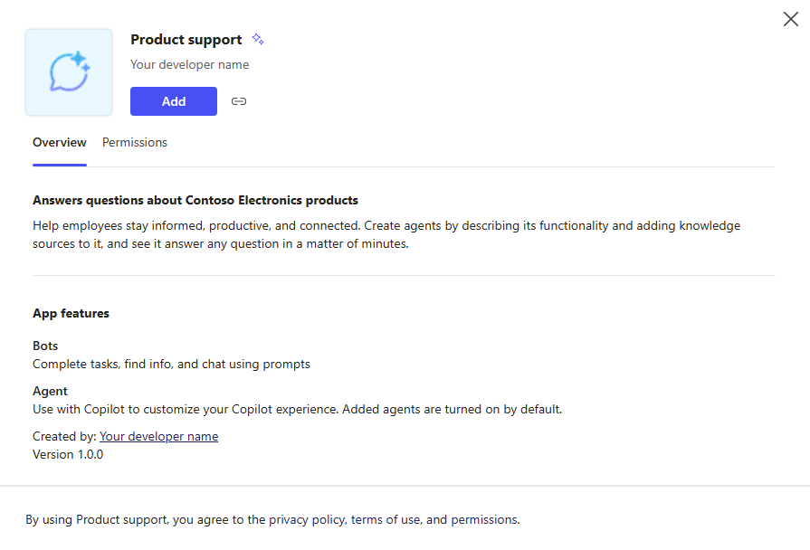

---
lab:
  title: '1.1: Erstellen eines deklarativen Agents'
---

# Erstellen eines deklarativen Agents

In dieser Übung erstellen Sie einen deklarativen Agent mit generativer KI, optimieren die Anweisungen, veröffentlichen den Agent in Microsoft 365 und testen ihn in Microsoft 365 Copilot.

Diese Übung dauert ca. **20** Minuten.

## Erstellen eines deklarativen Agents mit generativer KI

Erstellen Sie zunächst einen neuen deklarativen Agent in Copilot Studio. Verwenden Sie generative KI, um die Anweisungen und Eigenschaften für den Agent zu entwerfen.

1. Navigieren Sie in einem Webbrowser zu [Microsoft Copilot Studio](https://copilotstudio.microsoft.com/) unter `https://copilotstudio.microsoft.com`.
1. Melden Sie sich mit einem Geschäfts-, Schul- oder Unikonto an, bei dem Sie über die Berechtigung zum Erstellen in Copilot Studio verfügen.
1. Wenn Sie auf der Seite **Willkommen bei Microsoft Copilot Studio** dazu aufgefordert werden, wählen Sie Ihr Land/Ihre Region aus und klicken Sie anschließend auf **Erste Schritte**.
1. Wenn das Popup-Fenster **Willkommen bei Copilot Studio!** angezeigt wird, wählen Sie **Überspringen**.
1. Wenn Sie Copilot Studio aufrufen, werden Sie wahrscheinlich in der Konversationsschnittstelle zum Erstellen eines neuen Agents beginnen. Dieser Assistent hilft Ihnen beim Einrichten eines *benutzerdefinierten* Agents.  Wählen Sie **...** und anschließend **Agentenerstellung abbrechen**, um diesen Assistenten zu beenden.  Wählen Sie **Beenden**, um zu bestätigen.

    

1. Navigieren Sie im linken Navigationsbereich zu **Agents**.
1. Wählen Sie auf der Agentseite die Option **Microsoft 365 Copilot** aus.
1. Wählen Sie auf der Seite **Microsoft 365 Copilot** im Agents-Abschnitt die Option **Hinzufügen**.

    

    Sie werden zur Konversationserstellung weitergeleitet, wo Sie den zu erstellenden Agent beschreiben können.

1. Sie werden aufgefordert, zu beschreiben, was Ihr Agent tun soll.  Geben Sie im Textfeld **Ihre Nachricht eingeben** der Konversationsschnittstelle Folgendes ein:

    ```md
    I'd like to create a product support agent that answers questions related to Contoso Electronics products.
    ```

1. Wählen Sie **Eingabe** oder **Senden**, um Ihre Nachricht zu versenden.
1. Wenn Sie aufgefordert werden, einen Namen für Ihren Agent vorzuschlagen, geben Sie `Product support` ein und senden Sie Ihre Nachricht.
1. Wählen Sie oben in der Konversationsschnittstelle die Option **Weiter zur Konfiguration**, um die Übersichtsseite des Agents anzuzeigen und zu überprüfen, was die generative KI bisher konfiguriert hat.

## Konfigurieren des Agents und Definieren von Anweisungen

Aktualisieren Sie als Nächstes die Eigenschaften und Metadaten des Agents manuell.

1. Überprüfen Sie den **Namen**, den der generative KI-Assistent für Ihren Agent definiert hat. Aktualisieren Sie den Namen, um sicherzustellen, dass er `Product support` lautet.
1. Aktualisieren Sie die Eigenschaft **Beschreibung** auf `A product support agent that can answer queries about Contoso Electronics products`.
1. Geben Sie im Textfeld **Anweisungen** Folgendes ein:
  
    ```md
        You are an agent tasked with answering questions about Contoso Electronics products. Start every response to the user with "Thanks for using a Copilot agent!\n\n" and then answer the questions and help the user.
    ```

1. Wählen Sie oben auf der Seite die Option **Erstellen**, um den Agent zu erstellen.  Nach ein paar Augenblicken gelangen Sie zur Übersichtsseite des Agents.

## Testen des Agents in Copilot Studio

Testen Sie als Nächstes das Verhalten Ihres Agents im Testbereich in Copilot Studio, bevor Sie es in Microsoft 365 Copilot veröffentlichen.

1. Beachten Sie auf der Übersichtsseite des Agents unter **Produkt-Support** im Abschnitt **Veröffentlichungsdetails**, dass der Agent noch nicht veröffentlicht wurde.

    

1. Wenn das Fenster **Agent testen** nicht rechts neben den Agent-Übersichtsinformationen angezeigt wird, wählen Sie die Schaltfläche **Testen** neben der Schaltfläche „Veröffentlichen“, um das Testfenster zu öffnen.
1. Geben Sie im Textfeld `What can you do?` ein und senden Sie Ihre Nachricht.
1. Warten Sie auf die Antwort. Beachten Sie, dass die Antwort mit dem Text „Vielen Dank, dass Sie einen Copilot-Agent verwenden!“ beginnt, wie in den Anweisungen beschrieben, die Sie zuvor für den Agent definiert haben.

    

    Beachten Sie auch, dass der Agent derzeit über Anweisungen verfügt, jedoch noch keine benutzerdefinierten Wissensquellen oder Aktionen hat. Sie haben den Agent noch nicht so konfiguriert, dass er Fragen zu Contoso-Produkten beantwortet. Dies werden Sie in der nächsten Übung tun.

    > [!NOTE]
    > Wenn Sie Ihren Agent bearbeiten müssen, schließen Sie das Testfenster und wählen Sie im Abschnitt **Details** der Agent-Übersichtsseite die Option **Bearbeiten**. Bevor Sie den Test wiederholen, klicken Sie bitte im Testfenster auf die Schaltfläche **Aktualisieren**, um die neuesten Änderungen zu laden.

## Veröffentlichen des Agents in Microsoft 365 Copilot

Veröffentlichen Sie als Nächstes Ihren deklarativen Agent in Microsoft 365 Copilot. Auf der Übersichtsseite des **Produktsupport-Agents**:

1. Wählen Sie die Schaltfläche **Veröffentlichen** aus. Sie werden aufgefordert, Informationen zu Ihrem Agent einzugeben, die den Benutzenden in Microsoft 365 Copilot und Microsoft Teams angezeigt werden.

    > [!NOTE]
    > Die Informationen zu diesem Formular werden verwendet, um den Katalogeintrag in den Office- und Teams-Katalogen Ihrer Organisation und der Liste der integrierten Microsoft Admin Center-Apps aufzufüllen. Es wird nicht vom Microsoft 365 Copilot-Sprachmodell verwendet, um Ihren Agent aufzurufen.

1. Geben Sie in das Textfeld **Kurzbeschreibung** den Wert `Answers questions about Contoso Electronics products` ein.
1. Übernehmen Sie die Standardvorschläge für die restlichen Felder.
1. Wählen Sie **Veröffentlichen** aus.
1. Warten Sie, bis der Agent veröffentlicht wurde.  Schließen Sie das modale Fenster während der Veröffentlichung nicht. Dies kann einige Minuten dauern.

    > [!NOTE]
    > Wenn Sie „Veröffentlichen“ auswählen, wird eine Bot-Ressource bereitgestellt, die Ihrem Agent entspricht, in der Microsoft Entra ID-Umgebung Ihres Mandanten. Die Ressource ermöglicht Benutzenden die Interaktion mit dem Agent in Microsoft Teams.

1. Sobald der Agent veröffentlicht wurde, wird das Fenster **Verfügbarkeitsoptionen** angezeigt.
1. Wählen Sie unter **Link teilen** die Option **Kopieren**, um den Freigabelink für Ihren Agent zu kopieren, und wählen Sie anschließend **Fertig**.
1. Beachten Sie, dass im Abschnitt **Details veröffentlichen** der Übersichtsseite Ihres Agent angezeigt wird, dass der Agent veröffentlicht wurde.

    

    Wenn Sie den Freigabelink erneut kopieren müssen, wählen Sie im Abschnitt **Veröffentlichungsdetails** die Option **Verfügbarkeitsoptionen**.

1. Öffnen Sie einen neuen Tab in Ihrem Webbrowser, fügen Sie den Freigabelink in die URL-Leiste ein und wählen Sie dann **Eingabe**. Ein modales Fenster wird mit einer Agent-Übersicht angezeigt. Hier werden die Informationen angezeigt, die Sie bei der Veröffentlichung über Ihren Agent angegeben haben und die für die Benutzenden sichtbar sind, sowie die von Ihrem Agent benötigten Berechtigungen.

    

1. Wählen Sie **Hinzufügen**, um Ihren Agent zu Microsoft 365 Copilot hinzuzufügen.
1. Warten Sie, bis Ihr Agent hinzugefügt wurde. Ihr Agent wird in Microsoft 365 Copilot gestartet.

## Testen des Agents in Microsoft 365 Copilot

Als Nächstes führen wir den deklarativen Agent in Microsoft 365 Copilot aus und überprüfen seine Funktionalität sowohl in der **immersiven** als auch in der **kontextbezogenen** Umgebung.

Nach den vorherigen Schritten befinden Sie sich derzeit in der **immersiven** Agent-Erfahrung. Beachten Sie im Bereich **Agents** neben der Chatoberfläche, dass **Produktsupport** als der Agent ausgewählt ist, mit dem Sie derzeit direkt chatten.


1. Geben Sie im Textfeld `What can you do?` ein und senden Sie Ihre Nachricht.
1. Senden Sie die Nachricht, und warten Sie auf die Antwort. Beachten Sie, dass die Antwort mit dem Text „Vielen Dank für Ihre Frage!“ beginnt, wie Sie es in den Agent-Anweisungen angegeben haben.

Im Browser werden wir die Erfahrung **In-Kontext** testen.

1. Wählen Sie über dem **Agents**-Bereich in der Randleiste die Option **Chat** oder **M365 Copilot** aus, um den immersiven Chat mit dem **Produktsupport**-Agent zu beenden und mit Microsoft 365 Copilot zu chatten.

    

1. Geben Sie im Meldungsfeld das <kbd>@</kbd>-Symbol ein. Das Flyout wird mit einer Liste der verfügbaren Agents angezeigt.

    

1. Wählen Sie im Flyout **Produktsupport** aus. Beachten Sie die Statusmeldung oberhalb des Nachrichtenfelds. Es zeigt **Mit Produktsupport chatten** an, was bedeutet, dass Sie die In-Context-Erfahrung des Agents verwenden.

    

1. Geben Sie im Textfeld `What can you do?` ein und senden Sie Ihre Nachricht.

1. Warten Sie auf die Antwort. Beachten Sie, dass die Antwort mit dem Text „Vielen Dank für Ihre Frage!“ beginnt, wie Sie es in den Agent-Anweisungen angegeben haben.

1. Um die In-Kontext-Erfahrung zu beenden, wählen Sie das (X) in der Statusmeldung aus. Beachten Sie, dass die Statusmeldung entfernt wird und im Chatfenster eine Meldung angezeigt wird, die darauf hinweist, dass Sie nicht mehr mit dem Agent chatten.

    

Sie haben ihren Agent jetzt sowohl in den immersiven als auch in kontextbezogenen Erfahrungen in Microsoft 365 Copilot getestet.
