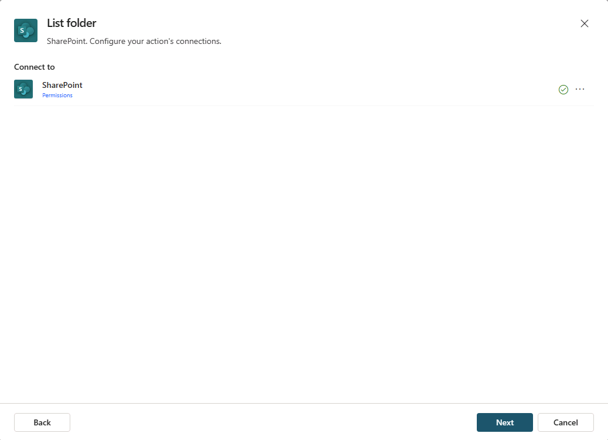

---
lab:
  title: '3.1: Erstellen einer Connectoraktion'
---

# Erstellen einer Connectoraktion

In dieser Übung konfigurieren Sie eine Connectoraktion für einen deklarativen Agent in Copilot Studio. Verwenden Sie den Connector „SharePoint – Listenordner“, um eine Liste der Dateien aus einem Produktordner abzurufen, der Produkt-Supportdateien enthält.

Diese Übung dauert ca. **15** Minuten.

## Vor der Installation

Diese Übung konzentriert sich auf das Hinzufügen von Connectoraktionen zu einem vorhandenen Agent. Bei dieser Übung wird Folgendes vorausgesetzt:

1. Sie haben bereits einen **deklarativen Produktsupport-Agent** in Copilot Studio erstellt. Wenn Sie Anweisungen zum Erstellen eines deklarativen Agents benötigen, lesen Sie: [Erstellen eines deklarativen Agents](../01-Build-your-first-declarative-agent/01-create-declarative-agent.md).
1. Sie verfügen über eine SharePoint-Website mit dem Namen **Produktunterstützung**, die eine Dokumentbibliothek namens **Produkte** enthält, in der Dateien mit Beispielprodukten gespeichert sind. Anweisungen finden Sie im Abschnitt **Bevor Sie beginnen** innerhalb der Übung: [Hinzufügen von benutzerdefiniertem Wissen](../01-Build-your-first-declarative-agent/02-add-custom-knowledge.md).

## Erstellen einer SharePoint-Connectoraktion

1. Navigieren Sie in Ihrem Webbrowser zu [Copilot Studio](https://www.copilotstudio.microsoft.com) unter `https://www.copilotstudio.microsoft.com`.
1. Wählen Sie in der **Bibliothek** Ihren **Produktsupport-Agent** aus.
1. Wählen Sie unter **Aktionen** die Option **Aktion hinzufügen** aus.
1. Geben Sie im Fenster **Aktion hinzufügen** in der Suchleiste **Suchen** den Wert `SharePoint` ein. Warten Sie, bis relevante Aktionen im Fenster angezeigt werden.
1. Suchen Sie die Connectoraktion **SharePoint-Ordnerliste** und wählen Sie sie aus.
1. Das modale Fenster zeigt eine Verbindung für den SharePoint-Connector an. Ein grünes Häkchen wird neben dem Connector angezeigt, wenn die Verbindung aktiv ist. Sie können **...** auswählen, um Details zur Verbindung anzuzeigen.
    
1. Wählen Sie **Weiter**, wenn die Verbindung aktiv ist. Sie werden zur Seite**Ordner auflisten** weitergeleitet, um die Eigenschaften für die Aktion zu konfigurieren.
1. Geben Sie `List product support files` in das Textfeld **Name** ein.
1. In das Textfeld **Beschreibung** geben Sie `List product support files available in the Products folder` ein.
1. Stellen Sie sicher, dass **Endbenutzerauthentifizierung** auf **Benutzerauthentifizierung** festgelegt ist.
1. Erweitern Sie den Abschnitt **Eingänge und Ausgänge**.
1. Wählen Sie die Eingabe **Siteadresse** aus.
1. Geben Sie im Textfeld **Wert** die URL zu Ihrer SharePoint-Website **Produktunterstützung** im Format `https://DOMAIN.sharepoint.com/sites/ProductSupport` ein und wählen Sie dann **Fertig**.
1. Wählen Sie die Eingabe **Dateikennung**.
1. Legen Sie **Wie soll der Agent diese Eingabe ausfüllen?** auf **Als Wert festlegen** aus der Dropdown-Liste fest und wählen Sie dann **Bestätigen**.
1. Geben Sie im Textfeld **Wert** den Wert `Products` ein und wählen Sie dann **Fertig**.
1. Wählen Sie die Schaltfläche **Aktion hinzufügen** und warten Sie, bis die SharePoint-Aktion Ihrem Agent hinzugefügt wurde. Die Aktion sollte nun im Abschnitt **Aktionen** auf der Detailseite Ihres Agents aufgeführt sein.

## Konfigurieren einer Aktion

1. Wählen Sie im Abschnitt **Aktionen** die Aktion **Produkt-Supportdateien auflisten** aus, um die Detailseite zu öffnen.
1. Navigieren Sie zur Registerkarte **Ausgaben**.
1. Aktivieren Sie zu Testzwecken unter **Wählen Sie aus, wie das Ergebnis dieser Aktion angezeigt werden soll** das Kontrollkästchen mit der Bezeichnung **Nach Ausführung der Aktion sofort eine Nachricht senden**. Es wird eine zusätzliche Konfigurationsoption angezeigt.
1. Wählen Sie das Dropdown-Menü unter **Wie sollen Informationen für den Benutzer angezeigt werden?** und wählen Sie dann **Eine Nachricht erstellen**. Ein Textfeld wird angezeigt.
1. Geben Sie in das Textfeld **Anzuzeigende Nachricht** `You used the SharePoint connector` ein und wählen Sie oben auf der Seite **Speichern**.

## Ändern der Anweisungen des Agents

Lassen Sie uns auch die Anweisungen Ihres Agents aktualisieren, die Anleitungen zur Verwendung der Connectoraktion bereitstellen.

1. Wählen Sie im Abschnitt **Details** Ihres **Produktsupport**-Agents die Option **Bearbeiten**.
1. Fügen Sie im Textfeld **Anweisungen** den folgenden Text zu den vorhandenen Anweisungen hinzu: `When asked about available support resources, use the SharePoint connector to list the files in the Products folder.`
1. Wählen Sie **Speichern**.

## Testen des Agents mit der Aktion

1. Erweitern Sie den Bereich **Ihren Agent testen** auf der rechten Seite der Detailseite Ihres Agents.
1. Wählen Sie die Schaltfläche **Aktualisieren** im Testbereich, um die letzten Änderungen Ihres Agents zu laden.
1. Geben Sie in das Nachrichtenfeld `What product support files are available?` ein und senden Sie die Nachricht.
1. Beachten Sie, dass Ihr Agent mit der Meldung „Sie haben den SharePoint Connector verwendet“ antwortet und dann die im Ordner Produkte verfügbaren Dateien auflistet.

Sie haben überprüft, dass Ihre Connectoraktion wie erwartet innerhalb Ihres Agents funktioniert.
